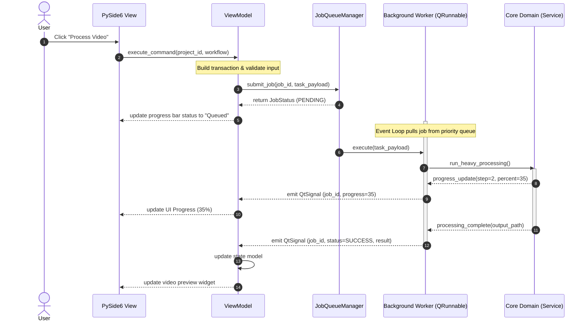
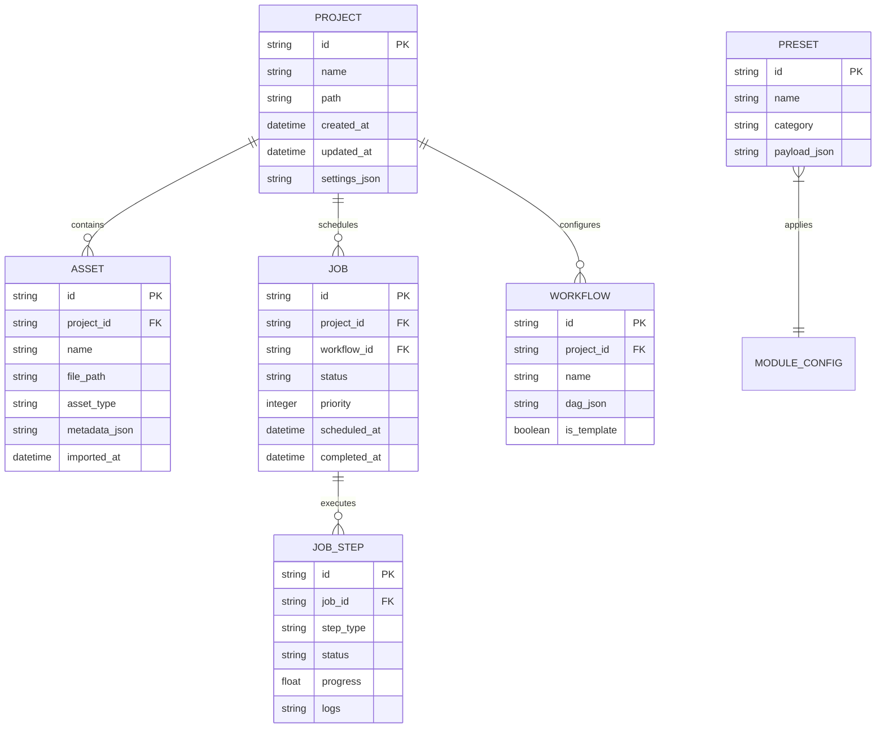
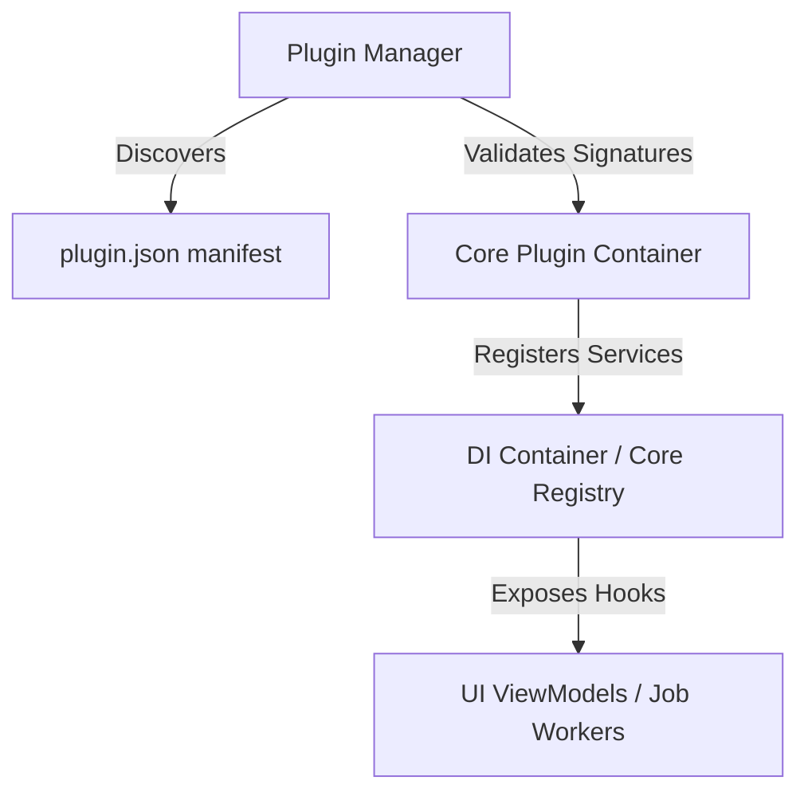
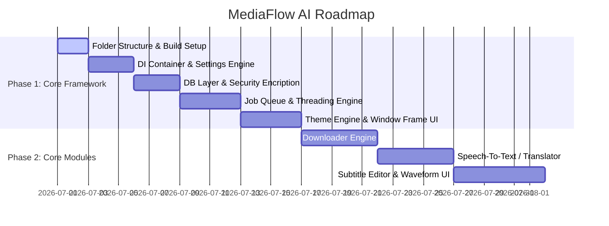

# MediaFlow AI: Architecture Design Document
**System Architecture & Design Specification**  
**Version:** 1.0.0  
**Author:** Senior Software Architect  
**Target Platform:** Cross-platform (Windows, macOS, Linux)  
**Language:** Python 3.13+

---

## 1. Executive Summary & Design Philosophy

**MediaFlow AI** is a next-generation, professional AI-powered media processing studio. To build an application that scales seamlessly over a 5–10 year horizon, supports a dynamic plugin ecosystem, and remains highly performant, the architecture must strictly enforce **separation of concerns**, **unidirectional data flow**, and **loose coupling**.

### Core Pillars
1. **Clean Architecture & SOLID:** The core domain logic remains completely agnostic of the GUI (PySide6) and external libraries. Infrastructure concerns (like FFmpeg or specific AI APIs) are hidden behind abstract repository interfaces.
2. **MVVM (Model-View-ViewModel):** The user interface is driven by PySide6. The View binds strictly to the ViewModel, which handles state translation and dispatches actions to the Service layer. ViewModels communicate via signals and thread-safe data bindings.
3. **Plugin-First Design:** Features like voice cloning, upscaling, or custom video downloaders are registered as plugins. The core application loads plugins dynamically using manifest contracts, executing them in isolated contexts (sandboxing where possible).
4. **Resilient Background Execution:** Media processing is highly resource-intensive. All long-running operations are dispatched to a multi-threaded, priority-based, thread-safe Job Queue running outside the main GUI thread.
5. **Premium Aesthetic System:** Custom Qt stylesheets (QSS), responsive layouts, rounded corners, soft shadows, and dynamic transitions are encapsulated in a centralized `ThemeEngine`. No hardcoded colors or ad-hoc style sheets are allowed.

---

## 2. Global Directory Layout

The workspace is organized into clear architectural layers, ensuring that infrastructure, application logic, domain rules, and user interfaces are decoupled.

```text
MediaFlowAI/
├── app/
│   ├── core/                    # Enterprise Domain rules & interfaces (Pure Python)
│   │   ├── entities/            # Core domain models (Project, Job, Asset, Preset)
│   │   ├── interfaces/          # Abstract contracts (Repositories, AI Services)
│   │   └── exceptions.py        # Domain-specific exceptions
│   │
│   ├── infrastructure/          # Concrete implementations of core interfaces
│   │   ├── database/            # SQLAlchemy DB models, Migrations, Repositories
│   │   ├── services/            # Implementations of AI, Translation, Speech, etc.
│   │   ├── security/            # API Key encryption, keyring integration
│   │   └── config/              # YAML config parsers, schema validations
│   │
│   ├── application/             # Application Use Cases & Coordination
│   │   ├── services/            # ProjectManager, WorkflowEngine, JobQueueManager
│   │   └── di/                  # Dependency Injection container
│   │
│   ├── modules/                 # Core features implemented as standard internal plugins
│   │   ├── download/
│   │   ├── subtitle/
│   │   ├── translation/
│   │   ├── speech/
│   │   ├── enhancement/
│   │   └── workflow/            # Visual Workflow Engine (DAG parser)
│   │
│   ├── ui/                      # Presentation layer (PySide6 / Qt6)
│   │   ├── components/          # Reusable Figma-like widgets (buttons, cards, inputs)
│   │   ├── views/               # Window, Workspace, Timeline, Settings Views
│   │   ├── viewmodels/          # MVVM ViewModels linking UI to Services
│   │   └── themes/              # QSS styling, design tokens, icons, assets
│   │
│   ├── plugins/                 # Extensible external plugins directory
│   │   └── sdk/                 # Developer SDK for writing plugins
│   │
│   └── main.py                  # Application entry point
│
├── tests/                       # Complete pytest suite (unit, integration, mock)
├── docs/                        # API & user documentation
├── pyproject.toml               # Poetry/Ruff/Mypy/Pytest configurations
└── config.yaml                  # System default configuration
```

---

## 3. High-Level Architecture Diagram (C4 Component Level)

```mermaid
graph TD
    subgraph UI Layer (PySide6)
        View[Views / Custom Widgets] -->|Binds & Observes| VM[ViewModels]
        VM -->|Triggers UI Updates| View
    end

    subgraph Application Layer
        VM -->|Calls Use Cases| AppServices[Application Services]
        AppServices -->|Dispatches Tasks| JobQueue[Thread-Safe Job Queue]
        AppServices -->|Resolves Types| DI[DI Container]
    end

    subgraph Core Domain Layer (Agnostic)
        AppServices -->|Manipulates| Entities[Domain Entities]
        AppServices -->|Queries/Saves| RepoInterfaces[Repository Interfaces]
        AppServices -->|Invokes| ServiceInterfaces[AI/Media Service Interfaces]
    end

    subgraph Infrastructure Layer
        RepoInterfaces -->|Implemented by| DBRepo[SQLAlchemy Repositories]
        ServiceInterfaces -->|Implemented by| AIService[AI Provider Hub]
        ServiceInterfaces -->|Implemented by| MediaProc[FFmpeg / GPU Pipelines]
        DBRepo -->|Reads/Writes| SQLite[(SQLite Database)]
        AIService -->|API Requests| CloudAI[OpenAI/Claude/Gemini/DeepSeek]
        MediaProc -->|Hardware Accel| Hardware[CUDA / Metal / DirectML]
    end

    classDef core fill:#e1f5fe,stroke:#01579b,stroke-width:2px;
    classDef app fill:#e8f5e9,stroke:#2e7d32,stroke-width:2px;
    classDef infra fill:#fff3e0,stroke:#e65100,stroke-width:2px;
    classDef ui fill:#f3e5f5,stroke:#4a148c,stroke-width:2px;
    class Entities,RepoInterfaces,ServiceInterfaces core;
    class VM,View ui;
    class AppServices,JobQueue,DI app;
    class DBRepo,AIService,MediaProc,SQLite,CloudAI,Hardware infra;
```

---

## 4. MVVM Communication & Threading Strategy

Directly updating PySide6 GUI components from background worker threads causes segmentation faults and application freezes. To maintain a responsive UI (60 FPS), we employ a strict **unidirectional messaging loop** mediated by Qt's metadata engine.



### Threading Rules:
- **Main Thread (GUI Thread):** Runs `QApplication.exec()`. Handles user events, paint events, QSS application, and frame rendering. **Never** performs disk I/O, network calls, or media processing.
- **Worker Threads:** Managed via a centralized `QThreadPool` configured with CPU/GPU dynamic core sizing.
- **Inter-Thread Communication:** Background workers report updates *only* via thread-safe thread-communication channels or custom `QEvent` / `Signal` slots. Direct modifications of UI elements from threads are statically and dynamically prohibited.

---

## 5. Visual Workflow & Node Engine (DAG representation)

The n8n-style workflow builder represents processing pipelines as a **Directed Acyclic Graph (DAG)**.

```mermaid
graph LR
    A[Download Node] -->|Video Path| B[Speech Recognition Node]
    B -->|Transcription (SRT)| C[Translation Node]
    B -->|Audio Track| D[Voice Clone Node]
    C -->|Translated Text| D
    C -->|Translated Subtitles| E[Burn Subtitles Node]
    D -->|Generated Audio| F[Audio Mixer Node]
    E -->|Processed Video| F
    F -->|Final Media| G[Export Node]

    style A fill:#f9f,stroke:#333,stroke-width:2px
    style G fill:#9f9,stroke:#333,stroke-width:2px
```

### Representation & Serialization Schema
Every workflow is serialized into a clean JSON structure detailing nodes and edges.
```json
{
  "workflow_id": "wf_b539cf2e",
  "name": "Auto Auto-Translate and Voiceover",
  "nodes": [
    {
      "id": "node_1",
      "type": "downloader",
      "parameters": {
        "url": "https://youtube.com/watch?v=...",
        "quality": "highest"
      }
    },
    {
      "id": "node_2",
      "type": "speech_to_text",
      "parameters": {
        "provider": "whisper",
        "model": "large-v3"
      }
    }
  ],
  "edges": [
    {
      "source": "node_1",
      "source_output": "video_file_path",
      "target": "node_2",
      "target_input": "audio_stream"
    }
  ]
}
```
* The `WorkflowEngine` parses the JSON, builds a dependency adjacency list, performs topological sorting to detect cycles, and executes tasks sequentially or concurrently based on independent branches.

---

## 6. Database Schema & Migration Architecture

We use **SQLite** for local storage with **SQLAlchemy 2.0 (async)** mapping entities. To guarantee user security, API Keys, proxy passwords, and cloud tokens are encrypted at rest using AES-256 via the platform's secure vault (Keyring / Windows Credential Manager).

### Entity Relationship Diagram


---

## 7. Dependency Injection & Service Locator

To avoid global states and circular imports, a clean Dependency Injection (DI) Container is loaded at boot time. All repositories, managers, and service providers are registered in the DI Container.

```python
class Container:
    """Centralized Dependency Injection Container for MediaFlow AI."""
    def __init__(self):
        self._services: dict[type, object] = {}
        self._factories: dict[type, callable] = {}

    def register_singleton(self, interface_cls: type, instance: object) -> None:
        self._services[interface_cls] = instance

    def register_factory(self, interface_cls: type, factory_func: callable) -> None:
        self._factories[interface_cls] = factory_func

    def resolve(self, interface_cls: type) -> any:
        if interface_cls in self._services:
            return self._services[interface_cls]
        if interface_cls in self._factories:
            return self._factories[interface_cls]()
        raise DependencyResolutionError(f"Service {interface_cls.__name__} not registered.")
```

### Module Registration Flow:
- When PySide6 launches, `main.py` initializes the `Container`.
- It loads user settings, instantiates database engine, and registers `DatabaseRepository`, `JobQueueManager`, and `AIProviderHub`.
- ViewModels receive dependencies explicitly via their constructor (`Dependency Injection`).

---

## 8. Extensible Plugin SDK

A modular plugin design allows independent developers to add new downloaders, AI models, or video filters without altering core logic.



### Plugin Standard Interface (`plugin.json`):
```json
{
  "plugin_id": "com.mediaflow.upscaler.realesrgan",
  "name": "Real-ESRGAN Upscaler",
  "version": "1.0.0",
  "sdk_version": ">=1.0.0",
  "entry_point": "realesrgan_plugin:RealESRGANPlugin",
  "dependencies": ["torch>=2.0.0"],
  "permissions": ["gpu_access", "local_file_system"]
}
```

### Python Base Contract:
```python
from abc import ABC, abstractmethod

class BasePlugin(ABC):
    """Abstract Base Class for all MediaFlow AI plugins."""
    
    @abstractmethod
    def initialize(self, context: "PluginContext") -> None:
        """Called when loading the plugin into the system context."""
        pass

    @abstractmethod
    def shutdown(self) -> None:
        """Cleanup plugin allocations, threadpools, and file descriptors."""
        pass
```

---

## 9. Premium UI/UX Design System & Theme Engine

To achieve the modern, clean, premium aesthetics matching **Figma, Arc, and Notion**, the design language defines strict design tokens. Cyberpunk neon or hyper-saturated gradients are replaced by high-contrast layout grids, soft drop-shadows, and elegant dark/light theme scales.

### Theme Palette (Dark Mode Premium Example)
- **Primary Background:** `#0B0C0E` (Deep charcoal, solid, not pitch black)
- **Secondary Surface:** `#16181C` (Panels, sidebar surfaces)
- **Accent Interactive:** `#E2E8F0` / `#0066CC` (Modern corporate slate / elegant royal blue)
- **Border / Divider:** `#2A2D35` (Thin, subtle separation)
- **Text Primary:** `#F8FAFC` (Soft white, eye-strain friendly)
- **Text Secondary:** `#94A3B8` (Cool gray for captions and secondary information)
- **System States:** Success `#10B981`, Warning `#F59E0B`, Danger `#EF4444`.

### QSS Custom Controls & Dynamic Animations
- Rounded corners (`border-radius: 8px` on main panels, `4px` on buttons).
- Border highlights on hover: `border: 1px solid rgba(255, 255, 255, 0.15)`.
- GPU-accelerated transition animations using PySide6's `QPropertyAnimation` for expanding sidebars and switching workspaces.

---

## 10. Implementation Plan & Quality Assurance Gates

Development is split into structured, sequential phases. The completion of each phase acts as a QA gate.



### Verification Criteria at the End of Every Phase:
1. **Linting and Validation:** 100% compliant with `ruff`, `black`, and type-checked via `mypy --strict`.
2. **Testing Coverage:** Minimum 85% test coverage using `pytest` (unit and mock layers).
3. **Logs & Diagnostics:** Clear logging schema using `loguru` with rotation, level filtration, and console routing.
4. **No Circular Imports:** Static architecture analysis via `import-linter`.

---
*End of Design Specification.*
